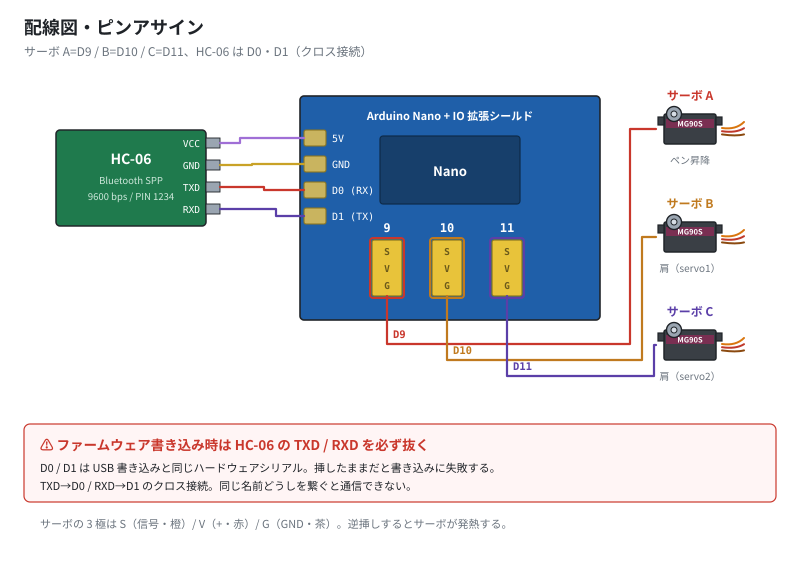
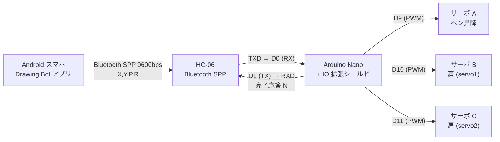

# 03. 配線図・ピンアサイン

[← 目次に戻る](../../README.md) ／ 前へ [02. 組み立て](02-assembly.md)

公式資料には配線「図」しかなく、ピン番号が文章で書かれていません。
ここでは公式配線図（付属組立説明書の 11 ページ目）と
ファームウェアのソースを突き合わせて確定させたピンアサインを示します。

---

## 1. ピンアサイン一覧

| 接続先 | Arduino ピン | 公式図の記号 | 役割 |
|---|---|---|---|
| サーボ（ペン昇降） | **D9** | **A** | ペンの上げ下げ |
| サーボ（肩・その1） | **D10** | **B** | 左肩（コード上の `servo1`） |
| サーボ（肩・その2） | **D11** | **C** | 右肩（コード上の `servo2`） |
| HC-06 `TXD` | **D0 (RX)** | 赤線 | Bluetooth → Arduino |
| HC-06 `RXD` | **D1 (TX)** | 紫線 | Arduino → Bluetooth |
| HC-06 `VCC` | 5V | 薄紫線 | 電源 |
| HC-06 `GND` | GND | 黄線 | 電源 |

### 根拠

付属ファームウェア `Drawing.ino` の `setup()`:

```cpp
servo1.attach(10);   // 肩サーボ 1  → D10（公式図の B）
servo2.attach(11);   // 肩サーボ 2  → D11（公式図の C）
servoup.attach(9);   // ペン昇降   → D9 （公式図の A）
...
Serial.begin(9600);  // HC-06 はハードウェアシリアル D0/D1
```

公式配線図でも、ピンヘッダの `9` の列にサーボ A、`10` の列にサーボ B、`11` の列にサーボ C の
線が引かれており、ソースと一致します。

---

## 2. 配線の全体像





---

## 3. サーボの 3 極コネクタ

拡張シールドのサーボ端子は、シルクに `S` `U`(=V, +5V) `G` と印字された 3 列です。

| ピン | シールド表記 | MG90S ケーブル色 |
|---|---|---|
| 信号 | `S` | **オレンジ**（または黄） |
| 電源 + | `U` / `V` | **赤** |
| GND | `G` | **茶**（または黒） |

> ⚠️ **逆挿し注意**: `S` と `G` を逆に挿すとサーボが動かず、モジュールによっては発熱します。
> 通電前に 3 本とも色の並びを確認してください。

---

## 4. HC-06 の配線（間違えやすい所）

```
  HC-06 側        Arduino 側
  ────────        ─────────
   VCC   ────────  5V
   GND   ────────  GND
   TXD   ────────  D0 (RX)     ← クロス接続
   RXD   ────────  D1 (TX)     ← クロス接続
```

**TXD → RX、RXD → TX** のクロス接続です。TXD→TX のように「同じ名前どうし」でつなぐと通信できません。

---

## 5. ⚠️ ファームウェア書き込み時の注意

HC-06 は **D0/D1（ハードウェアシリアル）** に直結されています。
これは Arduino Nano が USB 経由でスケッチを書き込むときに使う配線と同じです。

**HC-06 を挿したままだと、書き込みが失敗するか、不安定になります。**

書き込み時は必ず:

1. HC-06 の **TXD と RXD の 2 本を抜く**（VCC/GND は挿したままで可）
2. スケッチを書き込む
3. 書き込み完了後に 2 本を戻す

この注意は公式資料のどこにも書かれていません。書き込みが
`avrdude: stk500_recv(): programmer is not responding` などで失敗する場合、
まずこれを疑ってください。

---

## 6. 電源について

| 給電方法 | 状況 |
|---|---|
| **Mini-USB（5V）** | 公式の組立写真 ⑫ で使われている方法。動作確認・書き込みはこれで可能 |
| シールドの DC ジャック | 端子は実装されているが、**推奨電圧が公式資料に一切記載されていません** |

DC ジャックを使う場合は、Arduino Nano の VIN 経由となるため一般には 7〜12 V ですが、
**この製品固有の推奨値は付属資料では確認できませんでした**。
不明なまま高い電圧をかけるのは避け、まずは USB 給電で動作確認することを推奨します。

> **サーボ 3 個を同時に動かすと USB の 5V が電圧降下し、Arduino がリセットすることがあります。**
> 描画中に勝手に再起動する場合は、電源容量不足を疑ってください（[07](07-calibration-and-troubleshooting.md)）。

---

## 7. 配線後のチェックリスト

- [ ] サーボ 3 本すべて、`S`/`V`/`G` の向きが合っている
- [ ] サーボ A が D9、B が D10、C が D11 に挿さっている
- [ ] HC-06 の TXD が **D0**、RXD が **D1**（クロス）
- [ ] HC-06 の VCC が 5V（3.3V ではない）
- [ ] 通電すると HC-06 の LED が高速点滅する

---

次へ → [04. ファームウェア](04-firmware.md)
