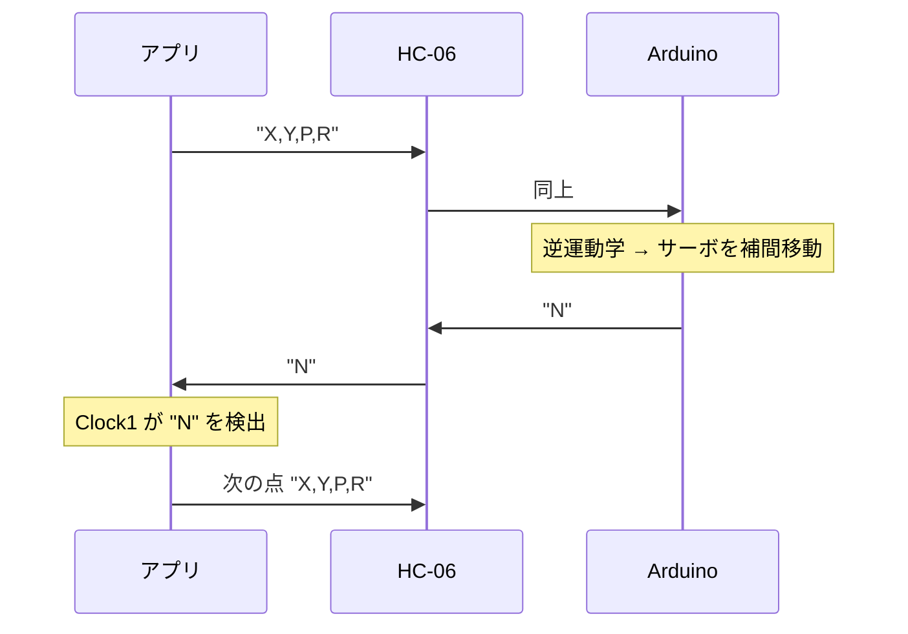

# 05. Android アプリの導入・接続・使い方

[← 目次に戻る](../../README.md) ／ 前へ [04. ファームウェア](04-firmware.md)

---

## 1. アプリの基本情報

製品に付属する `APP_Drawing Bot.apk` を解析して得た情報です。
（APK 自体はメーカーの著作物のため、本リポジトリには含めていません）

| 項目 | 値 |
|---|---|
| アプリ名 | **Drawing Bot** |
| 画面タイトル | ` Machinery Drawing Bot  V1.01` |
| パッケージ名 | `com.ai2offline.test.Minidrawing3` |
| バージョン | 1.01 (versionCode 1) |
| 対応 OS | Android（minSdk 7 / targetSdk 31） |
| 開発環境 | **MIT App Inventor 2**（オフライン版ビルダー） |
| 画面向き | 縦（portrait）固定 |
| SHA-256 | `70143a2c333d0d2c9bb01b8a3600c4ab54a20ee60b3f7557169d26f34084e896` |

### 要求パーミッション

| パーミッション | 用途 |
|---|---|
| `BLUETOOTH` / `BLUETOOTH_ADMIN` | Android 11 以前の Bluetooth 接続 |
| `BLUETOOTH_SCAN` / `BLUETOOTH_CONNECT` | Android 12 以降の Bluetooth 接続 |
| `READ_EXTERNAL_STORAGE` | App Inventor アプリが画像アセットを読むために付ける定型のもの |

> **位置情報の権限は要求しません。**
> これはアプリが「スキャン」ではなく **OS でペアリング済みのデバイス一覧** を使うためです。
> つまり **先に Android の設定画面で HC-06 とペアリングしておく必要があります**（下記手順 3）。

> ⚠️ **iPhone / iPad では使えません。** Android 専用アプリで、iOS 版は付属していません。
> また Bluetooth **Classic (SPP)** を使うため、iOS では原理的にこの HC-06 を扱えません。

---

## 2. インストール

Google Play では配布されていないため、APK を直接インストールします。

1. 製品に付属する `APP_Drawing Bot.apk` を Android 端末にコピーします。
   - `Backup/APP_Drawing Bot.zip` にも同じ APK が入っています（中身は同一）。
2. ファイルマネージャで APK をタップします。
3. 「提供元不明のアプリ」「この提供元のアプリを許可」といった確認が出たら許可します。
4. インストール後、アプリを起動して **権限をすべて許可** します。
   - Android 12 以降では「**近くのデバイス**」の許可が必須です。ここを拒否すると接続できません。
   - 拒否してしまった場合: 設定 → アプリ → Drawing Bot → 権限 → 「近くのデバイス」を許可

---

## 3. HC-06 とのペアリング（OS 側の作業）

**アプリを開く前に、Android の設定でペアリングを済ませてください。**

1. プロッターに通電します（HC-06 の LED が高速点滅します）。
2. Android の **設定 → Bluetooth** を開きます。
3. デバイス一覧から **`HC-06`** を選びます。
4. PIN の入力を求められたら **`1234`** を入力します。
5. 「ペアリング済み」になれば OK です。

> 公式資料 `3.APP bluetooth Video/APP bluetooth connection tutorial.txt` にも
> 同じことが書かれています（PIN = 1234）。

---

## 4. アプリの画面と操作

APK の解析から確認できた UI 部品です。

| 画面上の要素 | 内部名 | 動作 |
|---|---|---|
| **Bluetooth**（上部のボタン） | `BTpickbutton` | ペアリング済みデバイス一覧を表示 → `HC-06` を選ぶと接続。ラベルが `Connect` ⇄ `Disconnect` に変わります |
| **描画エリア**（黒い大きな領域） | `Canvas1` | 指でなぞると線が描かれ、その軌跡がプロッターに送られます |
| **Redraw 重新描绘** | `btn_redraw` | 直前に描いた軌跡をもう一度最初から実行します |
| **Clear 清除描绘** | `btn_clear` | 描画エリアと記憶した座標列を消去します |
| 座標表示 | `Label1` | 送信中の座標（`运行坐标` = 実行中の座標）と `Send Data` を表示します |
| **ESC** | — | アプリを終了します |

### 使い方の流れ

1. アプリを起動します。
2. 上部の **Bluetooth** ボタンを押し、一覧から **`HC-06`** を選びます。
   - 接続に成功するとラベルが `Disconnect` に変わります。
   - 失敗すると `Connection problem` というダイアログが出ます。
3. 描画エリアを指でなぞります。
   - 指を **置いた瞬間にペンが下り**、**離した瞬間にペンが上がります**。
   - なぞった座標はアプリ内に順番に記録されます。
4. プロッターが 1 点ずつ実行していきます。**指の動きより実機はかなり遅れます**。
5. 同じ絵をもう一度描かせたいときは **Redraw**、消したいときは **Clear** を押します。

### 動作の仕組み（フロー制御）

アプリは **Arduino から `N` が返ってくるまで次の点を送りません**。
そのため、指を速く動かしても取りこぼしはなく、実機がゆっくり追いかける形になります。

---

## 5. 接続できないときの確認順

| 症状 | 確認 |
|---|---|
| デバイス一覧に `HC-06` が出ない | OS の設定でペアリング済みか（アプリはペアリング済み一覧しか見ません） |
| 一覧に出るが接続に失敗する（`Connection problem`） | ① プロッターに通電しているか ② 他のアプリ／他の端末が HC-06 を掴んでいないか ③ Android 12 以降で「近くのデバイス」権限を許可したか |
| 接続はできるがサーボが動かない | ① ファームウェアが書き込まれているか（[04](04-firmware.md)） ② HC-06 の TXD/RXD が **D0/D1 にクロス接続** されているか（[03](03-wiring.md)） |
| 数点だけ描いて止まる | Arduino から `N` が返っていない。配線（TX 側 = D1 → HC-06 RXD）を確認 |
| 描いたはずの一部が描かれない | 描画可能範囲の外。[06](06-serial-protocol.md) の範囲図を参照 |

---

## 6. アプリを使わずに動かしたい場合

アプリは単に **`X,Y,P,R` という文字列を投げているだけ** です。
プロトコルは [06-serial-protocol.md](06-serial-protocol.md) に完全に文書化してあるので、
PC のシリアルターミナルや自作スクリプトからでも同じことができます。

Arduino IDE のシリアルモニタで試す場合:

1. HC-06 を外し、Mini-USB で PC につなぐ
2. シリアルモニタを **9600 baud**、行末設定は **「改行なし」** で開く
3. `0,205,1,R` のように送ると、その座標へ移動してペンが下ります

---

次へ → [06. シリアル通信プロトコル](06-serial-protocol.md)
