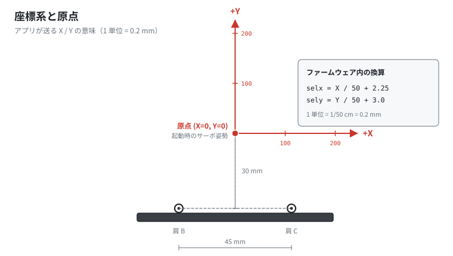
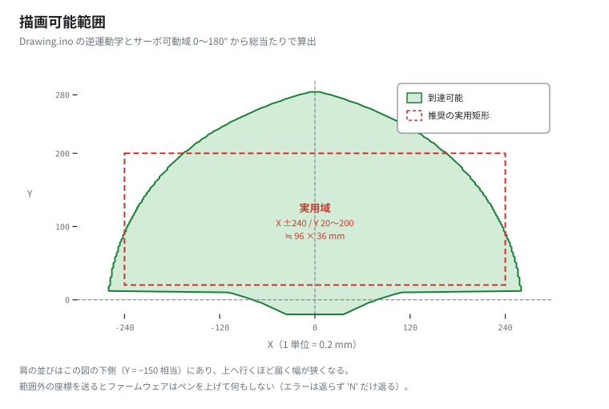

# 06. シリアル通信プロトコル・座標系・描画範囲

[← 目次に戻る](../../README.md) ／ 前へ [05. Android アプリ](05-android-app.md)

公式資料にはプロトコルの記載が一切ありません。
以下は `Drawing.ino` と `APP_Drawing Bot.apk` の両方を解析して確定した仕様です。

---

## 1. 物理層

| 項目 | 値 |
|---|---|
| 方式 | Bluetooth Classic SPP（HC-06）／ または Mini-USB の仮想 COM |
| ボーレート | **9600 bps** |
| データ形式 | 8bit / パリティなし / ストップ 1bit |
| ペアリング PIN | `1234` |

---

## 2. コマンド書式（ホスト → プロッター）

```
X,Y,P,R
```

| フィールド | 型 | 意味 |
|---|---|---|
| `X` | 数値 | 目標 X 座標（**0.2 mm 単位**） |
| `Y` | 数値 | 目標 Y 座標（**0.2 mm 単位**） |
| `P` | `0` / `1` | `0` = ペン上げ、`1` = ペン下げ |
| `R` | 文字 | **終端子**。この文字を受け取った瞬間に 1 コマンドとして確定します |

### 例

```
0,205,1,R      → (0, 205) へ移動してペンを下ろす
-100,100,0,R   → (-100, 100) へペンを上げたまま移動
```

### 解析ルール（実装上の注意）

`Drawing.ino` の `loop()` は **カンマを 3 回探します**。

- **カンマが 3 個必要です。** `X,Y,P` の後ろにもう 1 つカンマを付け、その後に `R` を送ります。
  つまり実際に流れるバイト列は `0,205,1,R` です（`P` の直後のカンマが 3 個目）。
- カンマが 3 個未満だと **`P` が更新されず、直前のペン状態が使われます**（エラーは返りません）。
- 数値として解釈できない文字列は `0` になります（`String::toDouble` / `toInt` の挙動）。
- 送信データに **`R` を含めてはいけません**。受信文字列中の最初の `R` で強制的に区切られます。

---

## 3. 応答（プロッター → ホスト）

```
N
```

1 コマンドの処理が終わるたびに、**改行なしで 1 文字 `N`** を返します。

- アプリはこの `N` を受け取ってから次の点を送ります（フロー制御）。
- **到達不能な座標でも `N` は返ります**（何もせずに `N` だけ返す）。
  つまり `N` は「実行した」ではなく「受け付けて処理を終えた」の意味です。

---

## 4. 座標系




ファームウェア内部の変換式:

```cpp
selx = X / 50 + 2.25;   // [cm]  肩 B を原点とした X
sely = Y / 50 + 3.0;    // [cm]  肩の高さを 0 とした Y
```

| 項目 | 値 |
|---|---|
| 1 単位 | **0.2 mm**（= 1/50 cm） |
| 原点 (X=0, Y=0) | 左右の肩の中点から **30 mm 上** |
| X の正方向 | 肩 B → 肩 C の向き |
| Y の正方向 | 肩の並びから遠ざかる向き（紙の奥側） |
| 起動時の姿勢 | サーボ 120°/60° ≒ **座標 (0, 0)** に相当 |

---

## 5. 描画可能範囲

**長方形ではありません。** 2 本の腕が届く範囲はドーム型（レンズ型）になります。



図は `tools/workspace_map.py` と同じ計算式から生成しています。

### 数値で見た範囲

| Y（単位） | y [cm] | 到達できる X | 幅 |
|---|---|---|---|
| 0 | 3.00 | −79 〜 +79 | 31.6 mm |
| 20 | 3.40 | −259 〜 +259 | **103.6 mm** |
| 60 | 4.20 | −251 〜 +251 | 100.4 mm |
| 100 | 5.00 | −237 〜 +237 | 94.8 mm |
| 140 | 5.80 | −216 〜 +216 | 86.4 mm |
| 180 | 6.60 | −186 〜 +186 | 74.4 mm |
| 220 | 7.40 | −142 〜 +142 | 56.8 mm |
| 260 | 8.20 | −72 〜 +72 | 28.8 mm |
| 280 | 8.60 | −20 〜 +20 | 8.0 mm |

**実用的な目安**: おおむね **X: ±240 / Y: 20〜200** の範囲（約 **96 mm × 36 mm**）に収めると、
安全に長方形として使えます。

> `Y = 10` 以下で急に狭くなるのは、サーボ指令角が 0〜180 度の範囲を外れるためです
> （腕が畳まれすぎる領域）。

任意の座標が到達可能かは、次のコマンドで確認できます。

```bash
python3 tools/workspace_map.py --check 0 205
# (0, 205) は到達可能
#   ペン先位置 : x=2.25 cm, y=7.10 cm
#   サーボ指令 : servo1(D10)=62.84deg, servo2(D11)=117.16deg
```

---

## 6. 速度と分解能

| 項目 | 値 | 根拠 |
|---|---|---|
| サーボ補間の刻み | 1 度ごと | `for (pos = 0; pos <= abs(s1diff); pos += 1)` |
| 1 刻みの待ち時間 | 3 ms | `int msdelay = 3;` |
| ペン昇降の所要時間 | 約 300 ms | 10°→110° を 1 度刻み × 3 ms |
| 座標の分解能 | 0.2 mm | `divby = 50` |

**速度を変えたい場合**は `msdelay` を書き換えます。

- 大きくする（例 `5`〜`10`）→ 遅くなるがブレが減り、線がきれいになる
- 小さくする（例 `1`〜`2`）→ 速くなるが、機体が揺れて線が乱れる

---

## 7. 自作ホストから動かす場合の最小例

```python
import serial, time

ser = serial.Serial("/dev/ttyUSB0", 9600)   # Windows なら "COM3" など
time.sleep(2)                                # Nano のリセット待ち

def move(x, y, pen):
    ser.write(f"{x},{y},{pen},R".encode())
    while ser.read(1) != b"N":               # 完了応答を待つ
        pass

move(-200,  40, 0)   # 左下へペンを上げたまま移動
move(-200,  40, 1)   # ペンを下ろす
move( 200,  40, 1)   # 横線
move( 200, 180, 1)   # 縦線
move(-200, 180, 1)
move(-200,  40, 1)
move(-200,  40, 0)   # ペンを上げる
```

> **必ず `N` を待ってください。** 待たずに送り続けると、Arduino 側の
> `String` バッファに溜まった文字が 1 つのコマンドとして混ざり、意図しない座標へ飛びます。

---

次へ → [07. 原点調整とトラブルシューティング](07-calibration-and-troubleshooting.md)
